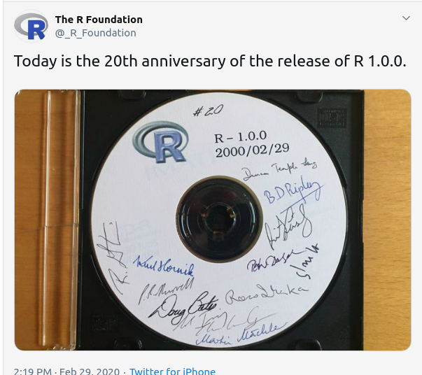

```{r setup, include=FALSE}
options(htmltools.dir.version = FALSE)
```


---
class: left, center 

# About Me

-- 

Binod Jung Bogati

--

R Community Lead

--

Data Science @ Numeric Mind 


---
class: left, center

# CelebRation2020 - Feb 29, 2020





---
class: left, middle  

# Today's Activity

- Introduction

- Community

- Setting up

- Start Hack-a-thon

- Break

- Conclude Project

---

class: center, middle

# Introduction

---
class: center, middle

# R User Group Nepal

A chapter of global R community

Run events in community

---
class: left, middle

# Plans for 2020

- 3 x Meetup / Workshops
- 1 x Hackathon
- 1 x Conference

---
class: left, middle

# Terminology

- *Open Data* is open and free to use data.
- *Open Source* is open and free to use source code.
- *Hackathon* is a event to build any product in limited timespan.

---

class: left, middle

# So for us, 

Open Data + Open Source + Hackathon = *Open Data Hackathon*

---

class: left, middle

# Tools 

- R / RStudio
- Tidyverse

--

- flexdashboard

--

- Highcharter

--

- Git / GitHub

---

class: left, middle

# Data set 

- Air pollution
- Australian Fire 
- CO2 Emission
- Covid19
- Global Plastic Consumption
- Nepal Food Price
- Nepal Tourism Report 2019

---

class: center

---

class: center, middle

# Thanks!
